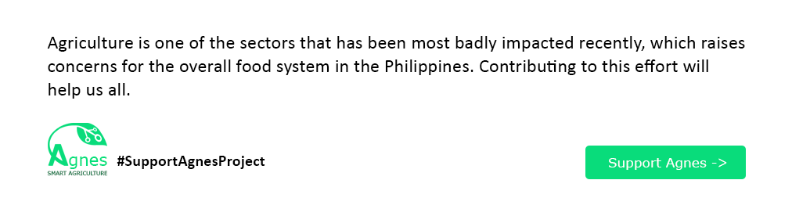

[](https://github.com/nerdmonkey/spartan-agnes-node)

## Spartan
Spartan is a sensor node for Agnes, which serve as a swiss army knife for data acquisition and a controller in smart agriculture. This node can collect farm data and toggle switches to assist farmers in leading lives of greater productivity, profitability, and lower input costs.

<p align="right">(<a href="#readme-top">back to top</a>)</p>

## Installation
1. Clone the repo
```sh
git clone https://github.com/nerdmonkey/spartan-agnes-node.git
```
2. Install python packages
```sh
pip install -r requirements.txt
```
3. Run it
```sh
uvicorn main:api --reload
```

<p align="right">(<a href="#readme-top">back to top</a>)</p>

<!-- ROADMAP -->
## Roadmap

- [x] Create device
- [ ] Read specific device
- [ ] Edit specific device
- [ ] Remove specific device
- [ ] Read all the devices
- [ ] Read all the devices by type
- [ ] Retrieve specific sensor value
- [ ] Switch on/off specific device
- [ ] Add authentication


See the [open issues](https://github.com/nerdmonkey/agnes-node/issues) for a full list of proposed features (and known issues).

<p align="right">(<a href="#readme-top">back to top</a>)</p>

<!-- CONTRIBUTING -->
## Contributing

Contributions are what make the open source community such an amazing place to learn, inspire, and create. Any contributions you make are **greatly appreciated**.

If you have a suggestion that would make this better, please fork the repo and create a pull request. You can also simply open an issue with the tag "enhancement".
Don't forget to give the project a star! Thanks again!

1. Fork the Project
2. Create your Feature Branch (`git checkout -b feature/AmazingFeature`)
3. Commit your Changes (`git commit -m 'Add some AmazingFeature'`)
4. Push to the Branch (`git push origin feature/AmazingFeature`)
5. Open a Pull Request

<p align="right">(<a href="#readme-top">back to top</a>)</p>

## License
The Agnes Node is open-sourced software licensed under the MIT license. See `LICENSE.md` for more information.

<p align="right">(<a href="#readme-top">back to top</a>)</p>


<!-- CONTACT -->
## Contact

Sydel Palinlin - [@Andeng](https://www.linkedin.com/in/sydel-palinlin/) - [sydel.palinlin@gmail.com](mailto:sydel.palinlin@gmail.com)

Project Link: [https://github.com/nerdmonkey/spartan-agnes-node](https://github.com/nerdmonkey/spartan-agnes-node)

<p align="right">(<a href="#readme-top">back to top</a>)</p>
